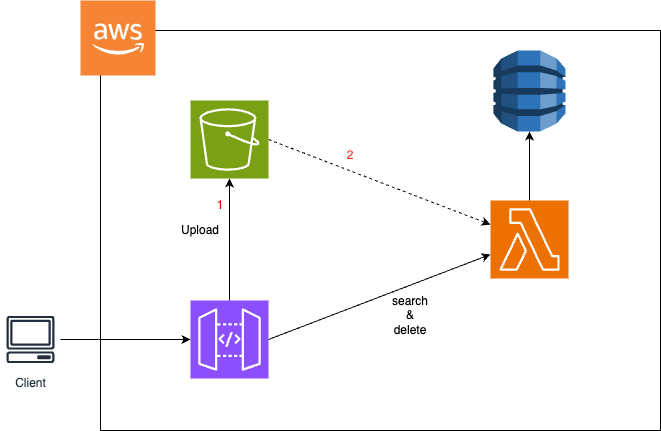

# Assignment
## High level summary:


There are 3 operation:
1. Uploading a file and storing the meta-data
2. Searching the item
3. Deleting the item

## Infra config:
1. APIGateway has been created with [configuration](https://github.com/soumenrock/assignment/blob/main/s3-upload-v1-swagger-apigateway.yaml)
2. Dynamo db has been created with below major configuration
   ```
   Partition key: name (String) 
   Sort key: extension
    ```
3. Lambda has been created and IAM role with policy for action dynamo read, write and delete added.
4. S3 bucket created with event trigger for the lambda for all object creation events.

## Usage:

### Upload operation
```
curl --location --request PUT 'https://qehdad4zg4.execute-api.ap-south-1.amazonaws.com/v1/upload/test.jpg' \
--header 'Content-Type: image/png' \
--data-binary '@/Users/soumen/Downloads/QRCode for Masterclass Learning Series - Feedback Form.png'
```

### Search operation
```
curl --location --request GET 'https://qehdad4zg4.execute-api.ap-south-1.amazonaws.com/v1/fetch' \
--header 'name: test' \
--header 'type: jpg'
```

### Delete operation
```
curl --location --request DELETE 'https://qehdad4zg4.execute-api.ap-south-1.amazonaws.com/v1/delete' \
--header 'name: test' \
--header 'type: jpg'
```
